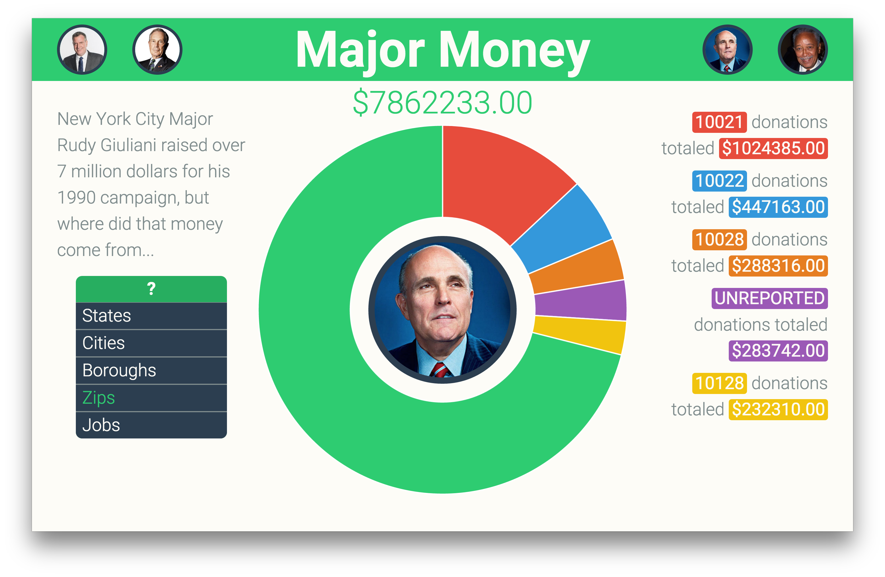

# Major Money

## Description

Major Money is a JavaScript based application that breaks-down and visualizes campaign donations to New York City Majors.

## Screenshots

Home page for Major Money showing all the recent NYC majors and a drop down menu to navigate the campaign donation data.

Page for major Bloomberg showing that all the 100 million dollars contributed to the Bloomberg campaign were donated by Bloomberg himself.

Page for major Giuliani showing his campaign donations broken down by ZIP code.

## Features

+ Efficiently parses NYC Open Data records on the client-side without the need for any back-end server.
+ Uses Charts.js to dynamically generate pie-charts based on donation data.
+ Completely custom CSS styling.

## Usage

Visit [Major Money](http://walterbm.github.io/major-money/) try-out the app and explore campaign donation information. 

## Author

- [Walter Beller-Morales](https://github.com/walterbm)

## License

Major Money is MIT Licensed. See LICENSE for details.